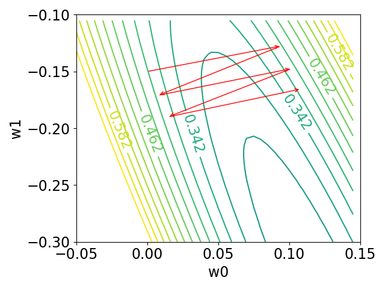
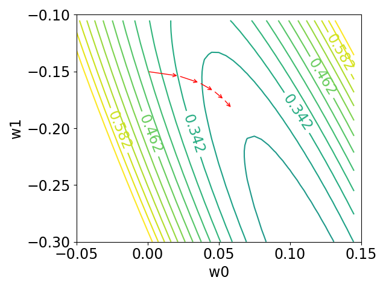
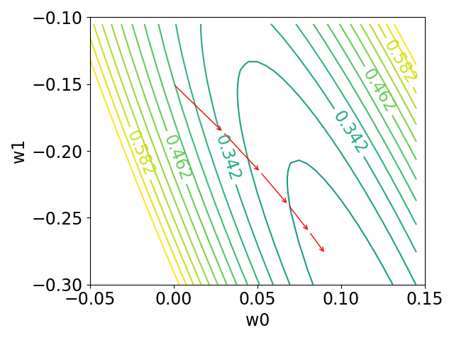

# LOANT
code for NAACL 2021 paper [Latent-Optimized Adversarial Neural Transfer for Sarcasm Detection](https://www.aclweb.org/anthology/2021.naacl-main.425/)

```
@inproceedings{guo-etal-2021-latent,
    title = "Latent-Optimized Adversarial Neural Transfer for Sarcasm Detection",
    author = "Guo, Xu  and
      Li, Boyang  and
      Yu, Han  and
      Miao, Chunyan",
    booktitle = "Proceedings of the 2021 Conference of the North American Chapter of the Association for Computational Linguistics: Human Language Technologies",
    month = jun,
    year = "2021",
    address = "Online",
    publisher = "Association for Computational Linguistics",
    url = "https://www.aclweb.org/anthology/2021.naacl-main.425",
    doi = "10.18653/v1/2021.naacl-main.425",
    pages = "5394--5407",
    abstract = "The existence of multiple datasets for sarcasm detection prompts us to apply transfer learning to exploit their commonality. The adversarial neural transfer (ANT) framework utilizes multiple loss terms that encourage the source-domain and the target-domain feature distributions to be similar while optimizing for domain-specific performance. However, these objectives may be in conflict, which can lead to optimization difficulties and sometimes diminished transfer. We propose a generalized latent optimization strategy that allows different losses to accommodate each other and improves training dynamics. The proposed method outperforms transfer learning and meta-learning baselines. In particular, we achieve 10.02{\%} absolute performance gain over the previous state of the art on the iSarcasm dataset.",
}
```

For any questions regarding the code and paper, email me [Xu Guo](mailto:xu008@e.ntu.edu.sg?subject=[GitHub]%20LOANT%20Sarcasm%Detection)

## Toy exmpale for minimizing the 2D function =w^{T}Aw%2Bb^{T}w%2Bc) with extragradient.

#### Steps:
1. manually create a matrix with condition number of 40 (to control the loss landscape to be eclipse): .
2. then generate a semi-definite matrix  (), a column vector b and a scalar c.
3. create a grid of ).
4. generate the loss value ) and plot the loss contour.
5. perform **_gradient descent_** with initial point ) and learning rate , plot the trajectory of w.
6. perform **_first-order extragradient_** with the same initial point and learning rate, plot the trajectory of w.
7. perform **_Full hessian extragradient_** with the same initial point and learning rate, plot the trajectory of w.

#### Run
```python extragradient.py```




## Sarcasm Detection Task
> To reproduce the results in paper, see ```Reproduce_results.ipynb```

> To re-conduct the experiments using my experimental environment.
download the [compressed python virtual env](https://drive.google.com/file/d/1hSvmuzkdSBU7MCwxTgq9UHw0BU_BbM2k/view?usp=sharing)
>
> ```source my_env/bin/activate```
>
> Run ```main.py```, and change the arg values. (GPU with at least 20GB of memory is required).

## Sarcasm Datasets
1. Ghosh: raw data downloaded from: [link](https://github.com/AniSkywalker/SarcasmDetection/tree/master/resource)
2. Ptacek: raw data downloaded from: [link](http://liks.fav.zcu.cz/sarcasm/)
3. SemEval18: raw data downloaded from: [link](https://github.com/Cyvhee/SemEval2018-Task3/tree/master/datasets)
4. iSarcasm: raw data given by the author and is also included under ```data/iSarcasm/raw```

#### My Processing Steps:
1. detect language, filter out non-english tweets
2. lexical normalization
3. filter out duplicate tweets across datasets
4. up-sampling target datasets